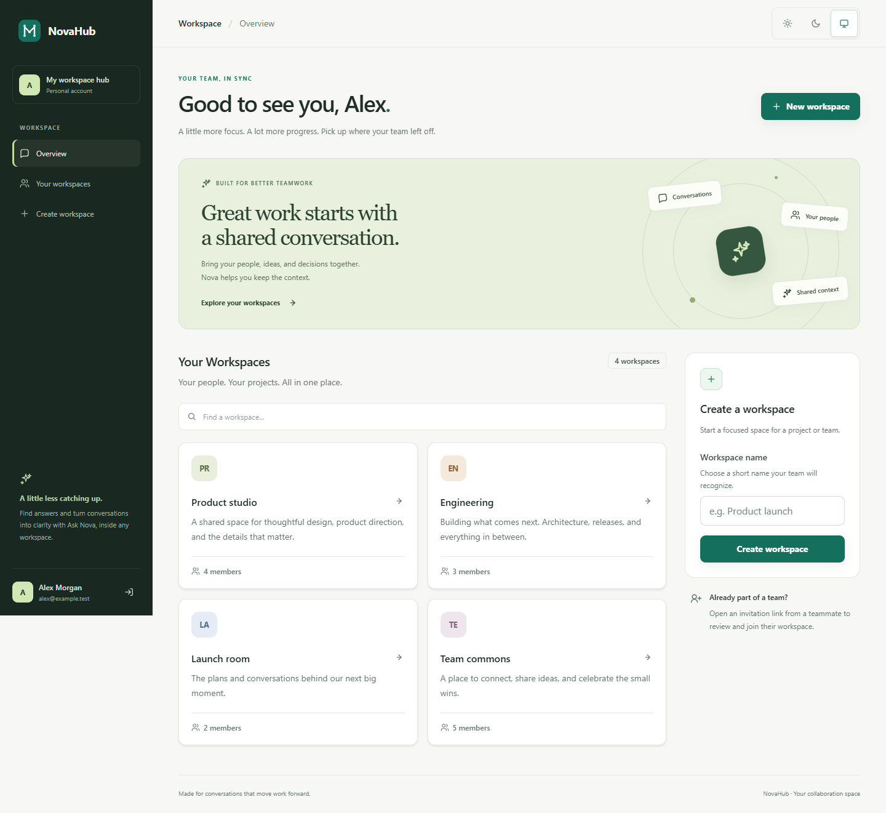
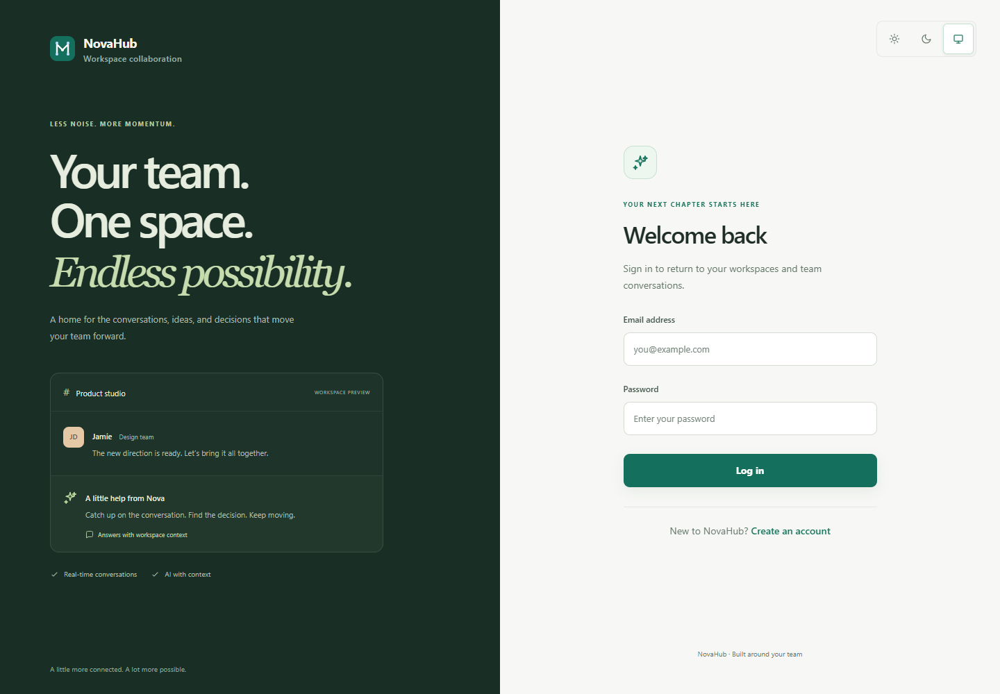
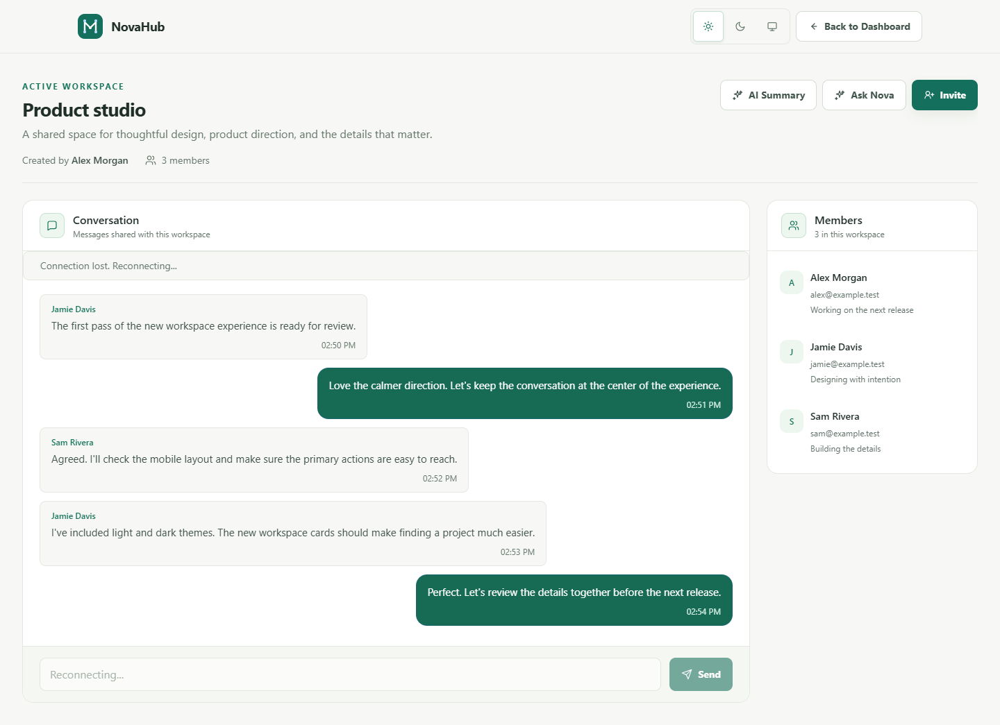
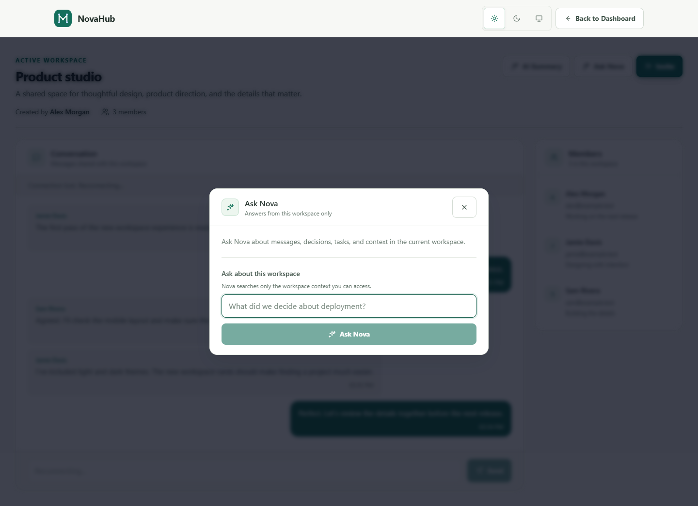
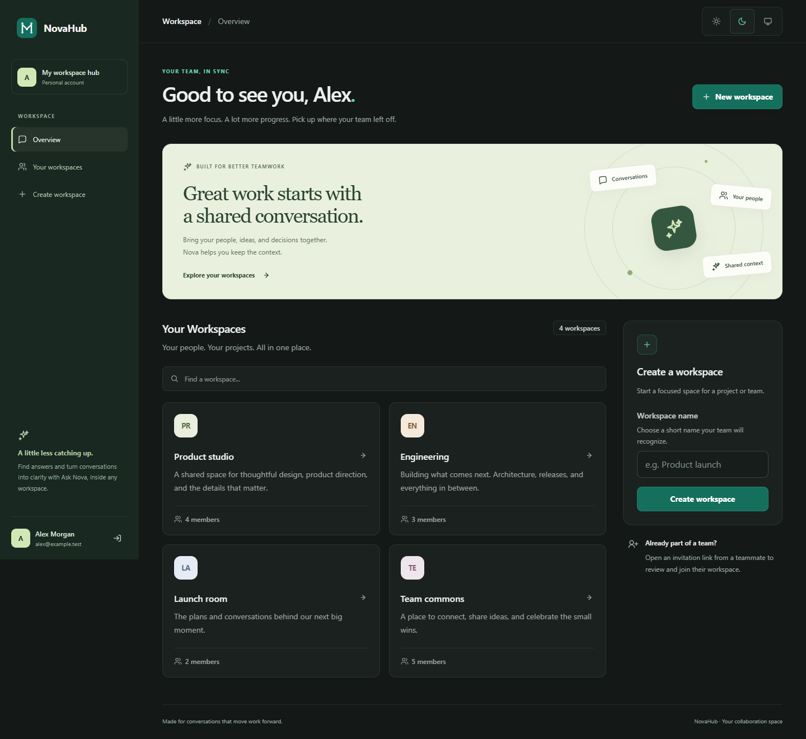
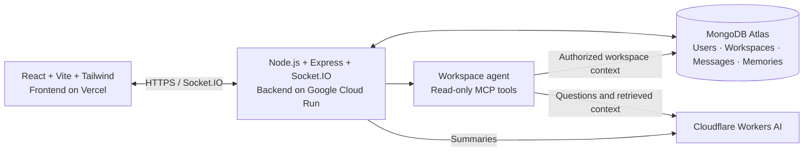

<div align="center">

# NovaHub

### Great work starts with a shared conversation.

Bring your team, conversations, and decisions into one workspace.<br />
Chat in real time, catch up with AI summaries, and ask Nova for the context you need.

<br />

[**Open NovaHub ↗**](https://nova-hub-sage.vercel.app) · [Explore the interface](#a-space-for-focused-work) · [Run locally](#run-it-locally) · [Deployment guide](./docs/deployment/github-actions-production.md)

<br />

[](https://github.com/asfiahamed0404/NovaHub/actions/workflows/production-deploy.yml)


<br />

<picture>
  <source media="(prefers-color-scheme: dark)" srcset="./artifacts/ui-preview/dashboard-dark.png" />
  <source media="(prefers-color-scheme: light)" srcset="./artifacts/ui-preview/dashboard-desktop.png" />
  
</picture>

<sub>Local UI preview with fictional workspace data. The overview above follows your light or dark appearance.</sub>

</div>

<br />

## Less catching up. More moving forward.

NovaHub is a full-stack collaboration platform built around a simple idea: a team's conversations should stay useful after the moment they happen. Workspaces bring people together; persistent chat keeps the history; AI summaries and Ask Nova help turn that history into shared context.

| Capability | What it brings to your team |
| :--- | :--- |
| **Real-time conversations** | Workspace chat, live member updates, and persistent message history through Socket.IO and MongoDB. |
| **Ask Nova** | Ask questions about the current workspace's messages, decisions, and saved memories using a bounded AI agent. |
| **AI catch-up** | Generate summaries with decisions and action items, including a missed-message view backed by read state. |
| **Shared workspace memory** | Review a proposed fact, decision, task, or note before choosing to save it for future context. |
| **Controlled invitations** | Share expiring, single-use links; review invitation status; revoke active links. |
| **Connection recovery** | Rejoin workspace rooms and recover missed messages after a temporary interruption, without a manual refresh. |

## A space for focused work

A calm interface with responsive layouts, light / dark / system appearance, workspace search, and clear loading, empty, error, and connection states.

<table>
  <tr>
    <td width="50%">
      
      <p><strong>A welcoming first step</strong><br />A shared visual language for sign-in and account creation.</p>
    </td>
    <td width="50%">
      
      <p><strong>Your conversation, in context</strong><br />Messages, members, and AI tools in one workspace.</p>
    </td>
  </tr>
  <tr>
    <td width="50%">
      
      <p><strong>A little less searching</strong><br />Ask about the work already happening around you.</p>
    </td>
    <td width="50%">
      
      <p><strong>Comfort in every theme</strong><br />Light, dark, or in sync with your system.</p>
    </td>
  </tr>
</table>

[View the mobile overview](./artifacts/ui-preview/dashboard-mobile.png) · [View mobile chat](./artifacts/ui-preview/workspace-mobile.png)

<sub>These are local design previews using fictional data. Conversation captures show the disconnected state because their preview transport is not attached to a backend. See the <a href="./artifacts/ui-preview/README.md">preview notes</a>.</sub>

<details>
<summary><strong>Watch the earlier real-time collaboration demo</strong></summary>

<br />


This recording shows the earlier interface demonstrating two-user messaging, connection loss, and missed-message recovery.

</details>

## Meet Nova, your workspace assistant

Ask a question such as **“What did we decide about deployment?”** or **“What are the next steps for this project?”** Nova retrieves context from the workspace you can access and uses Cloudflare Workers AI to produce an answer.

- **Workspace-scoped retrieval.** Authenticated tools search messages, retrieve recent conversations, and read workspace memories.
- **Bounded execution.** The agent uses a limited sequence of read-only Model Context Protocol (MCP) tools.
- **Human-approved memory.** Nova can propose useful context to remember. Saving it requires a separate, explicit user action.
- **Catch-up with structure.** Summaries surface an overview, decisions, and action items, with message and usage limits enforced by the server.

AI answers use bounded context and can be incomplete or incorrect. Review the underlying conversation before acting on a summary or saving a memory.

## Built beyond the happy path

The engineering work behind NovaHub focuses on the places collaboration apps tend to break.

| Concern | Implementation |
| :--- | :--- |
| **Who can access a workspace?** | JWT authentication on REST and Socket.IO, followed by server-side workspace membership checks. |
| **What if a message arrives while someone is offline?** | Reconnection rejoins the room, fetches persisted history, and merges messages by ID to avoid duplicates. |
| **What if two people accept the same invitation?** | MongoDB transactions and a conditional claim enforce single-use acceptance; the successful user's retry is idempotent. |
| **What happens to an invitation token?** | A cryptographically random token is returned once; only its SHA-256 hash is stored. Expiry, revocation, rate limits, and active-link caps constrain its use. |
| **Who controls AI capabilities?** | Server-side plan entitlements and usage limits, with workspace authorization applied to AI requests. |
| **How does a release reach production?** | Component-aware CI, commit-SHA container images, Google OIDC authentication, and a Cloud Run health check. |

## Architecture



| Layer | Technologies |
| :--- | :--- |
| **Interface** | React 19, Vite, Tailwind CSS, React Router, Axios |
| **API & real time** | Node.js 24, Express, Socket.IO |
| **Data & identity** | MongoDB Atlas, Mongoose, JWT, bcrypt |
| **AI & context** | Cloudflare Workers AI, MCP, Zod, workspace memory |
| **Delivery & verification** | Vercel, Google Cloud Run, Artifact Registry, GitHub Actions, Docker, Vitest, Node test runner |

### Two independent production deployments

**Frontend:** GitHub `main` → Vercel Git integration → automatic Vercel production deployment.

**Backend:** GitHub `main` → GitHub Actions validation → Docker build → Artifact Registry → Cloud Run → health check.

GitHub Actions validates changed components on pull requests and pushes. It deploys the backend only when selected backend changes reach `main`; manual backend deployment on `main` is also supported. Documentation-only changes skip application jobs, while workflow-only changes validate both components without a backend deployment.

Vercel handles frontend deployment independently of the GitHub Actions CI gate and Cloud Run health check. Its Git integration remains enabled; the Actions workflow needs no Vercel CLI secrets.

See the [production deployment guide](./docs/deployment/github-actions-production.md) for configuration, path rules, and failure behavior.

## Run it locally

### 1. Get the project

Use **Node.js 24.x**, npm, and a transaction-capable MongoDB deployment, such as an Atlas cluster or a local replica set. Docker is needed for the containerized integration suites.

```bash
git clone https://github.com/asfiahamed0404/NovaHub.git
cd NovaHub
npm --prefix backend ci
npm --prefix frontend ci
```

### 2. Configure your environment

Copy [backend/.env.example](./backend/.env.example) to `backend/.env` and [frontend/.env.example](./frontend/.env.example) to `frontend/.env`.

In `backend/.env`, set your development database connection and a strong, unique JWT secret:

```dotenv
PORT=5000
MONGO_URI=<your-development-mongodb-connection-string>
JWT_SECRET=<your-long-random-secret>
CLIENT_URL=http://localhost:5173
```

Keep these frontend values for a local backend:

```dotenv
VITE_API_URL=http://localhost:5000/api
VITE_SOCKET_URL=http://localhost:5000
```

To use AI features locally, configure `CLOUDFLARE_ACCOUNT_ID`, `CLOUDFLARE_API_TOKEN`, and `CLOUDFLARE_AI_MODEL` in the backend environment. The example file also documents invitation settings and AI limits. Keep credentials in local environment files; never commit them.

### 3. Start both services

From the repository root, run each command in a separate terminal:

```bash
# Terminal 1: API and Socket.IO
npm --prefix backend run dev
```

```bash
# Terminal 2: React development server
npm --prefix frontend run dev
```

Open **http://localhost:5173**. The backend runs at **http://localhost:5000**.

If local login or registration fails, confirm that the backend is running, MongoDB is connected, and the frontend API URL and backend allowed origin match the addresses above. Restart Vite after changing frontend environment variables.

## Quality checks

Run frontend checks from the repository root:

```bash
npm --prefix frontend test
npm --prefix frontend run lint
npm --prefix frontend run build
npm --prefix frontend audit
```

With Docker running, exercise invitation transactions and real Socket.IO clients against a disposable MongoDB replica set:

```bash
npm --prefix backend run test:integration:invitations:all:docker
```

Additional backend suites cover read state, AI summaries, workspace memory, MCP tools, the agent, approved memory, entitlements, and administration. The [production workflow](./.github/workflows/production-deploy.yml) lists the CI checks; the [integration test guide](./backend/tests/integration/README.md) explains the invitation harness and its database safeguards.

Browser and manual test procedures are collected in [docs/testing](./docs/testing/README.md).

## Explore the code

```text
NovaHub/
├── frontend/
│   └── src/             Pages, components, auth, themes, and socket client
├── backend/
│   ├── controllers/     Authentication, workspaces, invitations, chat, and AI
│   ├── services/        AI agent, workspace memory, entitlements, and admin
│   ├── models/          MongoDB schemas
│   ├── routes/          REST endpoints
│   └── tests/           Integration and regression coverage
├── .github/             CI workflow and change-detection checks
├── docs/                Deployment guide, testing procedures, and demo
└── artifacts/ui-preview/  Desktop and mobile interface captures
```

<details>
<summary><strong>API entry points and implementation boundaries</strong></summary>

<br />

| Area | Route or reference |
| :--- | :--- |
| Authentication | `/api/auth` · [routes](./backend/routes/authRoutes.js) |
| Workspaces & invitation management | `/api/workspaces` · [routes](./backend/routes/workspaceRoutes.js) |
| Invitation preview & acceptance | `/api/invitations/:token` · [routes](./backend/routes/invitationRoutes.js) |
| Messages | `/api/workspaces/:workspaceId/messages` · [routes](./backend/routes/messageRoutes.js) |
| AI summaries, agent & approved memories | `/api/workspaces/:workspaceId/ai` · [routes](./backend/routes/aiRoutes.js) |
| Read state | [routes](./backend/routes/readStateRoutes.js) |

Platform user/admin roles and free/premium summary entitlements are implemented. Workspace access is based on membership; platform administration is separate from workspace owner/admin/member roles.

Invitation URLs are bearer credentials and should be shared privately. JWTs are currently stored in browser local storage. Legacy join-by-workspace-ID is disabled by default and requires explicit backend and frontend compatibility flags. Invitation transactions require a replica set or sharded MongoDB deployment.

</details>

<br />

---

<div align="center">

**Bring your people, ideas, and decisions together.**

[Open NovaHub ↗](https://nova-hub-sage.vercel.app) · [Browse the code](https://github.com/asfiahamed0404/NovaHub) · [Read the deployment guide](./docs/deployment/github-actions-production.md)

Built by [@asfiahamed0404](https://github.com/asfiahamed0404).

</div>
