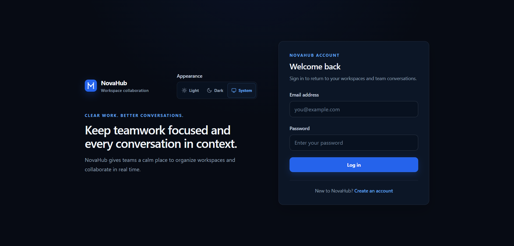
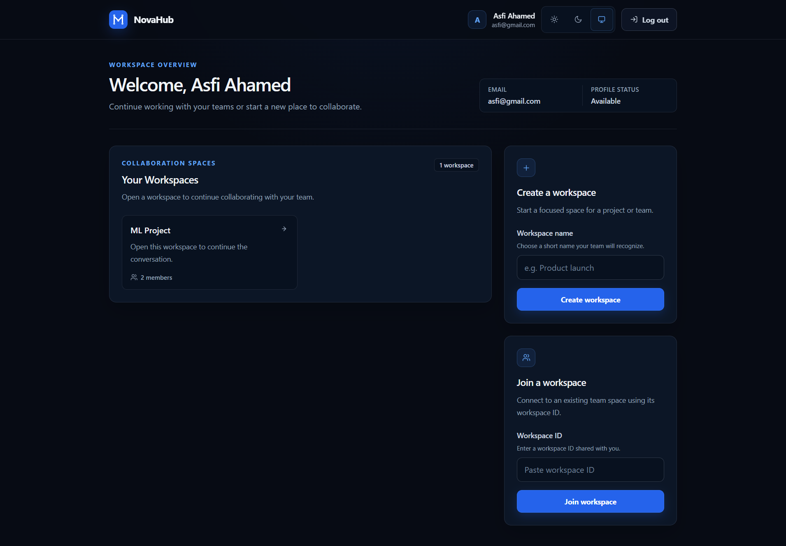
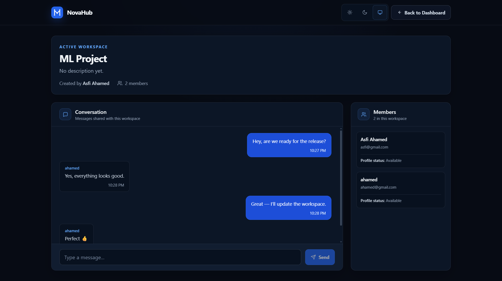
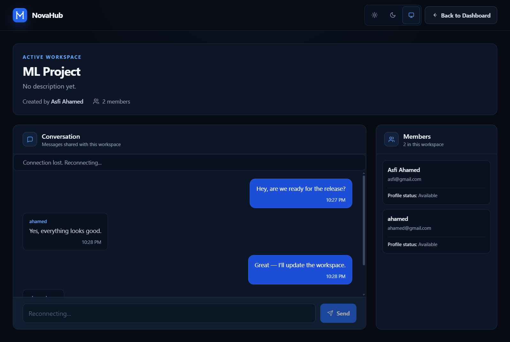
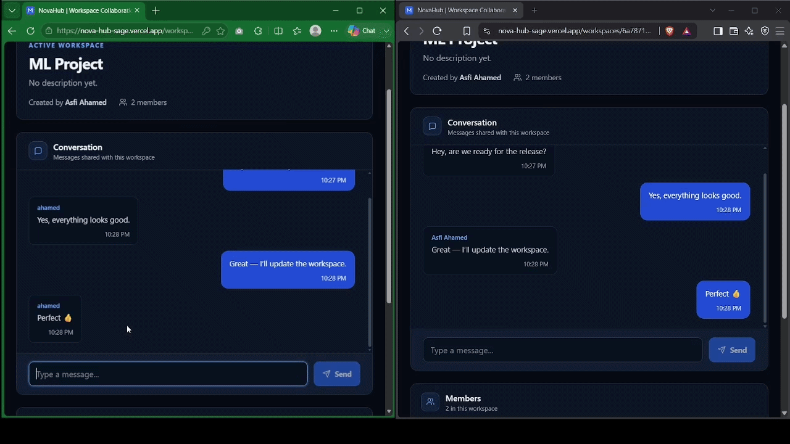

<div align="center">

# 🚀 NovaHub

### Real-Time AI-Powered Workspace Collaboration Platform

A production-deployed MERN collaboration platform combining secure real-time communication, AI-assisted workspace understanding, MCP-based agent tooling, human-approved persistent memory, and a protected platform administration console.

<br />

[](https://react.dev/)
[](https://nodejs.org/)
[](https://expressjs.com/)
[](https://www.mongodb.com/)
[](https://socket.io/)
[](https://modelcontextprotocol.io/)
[](https://vite.dev/)
[](https://tailwindcss.com/)

<br />

### 🌐 Live Application

**[Open NovaHub](https://nova-hub-sage.vercel.app)**

Frontend hosted on **Vercel** · Backend hosted on **Railway** · Database hosted on **MongoDB Atlas**

</div>

---

# 🎯 What is NovaHub?

NovaHub is a full-stack real-time collaboration platform built with the MERN stack.

The project began as a simple chat application and gradually evolved into a production-ready workspace platform with:

- secure authentication
- workspace management
- real-time messaging
- persistent message history
- secure invitation links
- automatic reconnection and missed-message recovery
- AI workspace summaries
- an MCP-based workspace agent
- human-approved persistent workspace memory
- AI entitlements and usage limits
- a protected platform administration console
- automated backend and frontend testing
- production CI/CD

NovaHub demonstrates how traditional SaaS collaboration features can work together with modern AI-agent architecture while maintaining clear authentication, authorization, tenant isolation, and human-control boundaries.

---

# ✨ Core Features

| Area | Features |
|---|---|
| 🔐 Authentication | JWT authentication, bcrypt hashing, protected routes, authenticated sockets |
| 🏢 Workspaces | Create, join, leave, invite members, persistent membership |
| ⚡ Real-Time Chat | Socket.IO rooms, persistent messages, live updates |
| 🔄 Recovery | Automatic reconnect, room rejoin, missed-message synchronization |
| 🔗 Invitations | Expiring, single-use, hashed invitation tokens |
| 🤖 Catch Me Up | AI-generated workspace conversation summaries |
| 🧠 Ask Nova | MCP-based workspace agent with tool-driven retrieval |
| 💾 Workspace Memory | Human-approved durable facts, decisions, tasks and notes |
| 🛡️ AI Safety | Read-only MCP tools, bounded agent loop, provenance and approval |
| 👑 Admin Console | Users, workspaces, AI usage, memories and platform statistics |
| 🚀 Deployment | Vercel + Railway + MongoDB Atlas |
| ✅ Quality | Integration tests, frontend tests, linting, protected CI |

---

# 📸 Screenshots

## Login

<div align="center">



</div>

<br />

## Workspace Dashboard

<div align="center">



</div>

<br />

## Real-Time Workspace Chat

<div align="center">



</div>

<br />

## Connection Recovery

<div align="center">



</div>

> Additional Ask Nova and Admin Console screenshots can be added under `docs/screenshots/`.

---

# 🎥 NovaHub in Action

<div align="center">



<br />

**Two-user real-time messaging, connection recovery, and missed-message synchronization.**

<br />

[▶ Watch the Full Demo](./docs/demo/novahub-realtime-demo.mp4)

</div>

---

# 🧩 System Architecture

```text
┌──────────────────────────────────────────────┐
│                   Browser                    │
│                                              │
│       React + Vite + Tailwind CSS            │
│                  Vercel                      │
│                                              │
│  ┌────────────────────────────────────────┐  │
│  │ Workspace UI                           │  │
│  │ Real-Time Chat                         │  │
│  │ Catch Me Up                            │  │
│  │ Ask Nova                               │  │
│  │ Platform Admin Console                 │  │
│  └────────────────────────────────────────┘  │
└──────────────────────┬───────────────────────┘
                       │
                HTTPS / Socket.IO
                       │
                       ▼
┌──────────────────────────────────────────────┐
│            Node.js + Express                 │
│                  Railway                     │
│                                              │
│  REST APIs                                   │
│  JWT Authentication                         │
│  Workspace Authorization                    │
│  Socket.IO                                   │
│  Invitation System                          │
│  AI Entitlements / Usage Limits             │
│  Workspace Agent                            │
│  MCP Workspace Tools                        │
│  Platform Admin APIs                        │
└──────────────────────┬───────────────────────┘
                       │
                    Mongoose
                       │
                       ▼
┌──────────────────────────────────────────────┐
│               MongoDB Atlas                  │
│                                              │
│ Users                                        │
│ Workspaces                                   │
│ Messages                                     │
│ Invitations                                  │
│ Workspace Memories                           │
│ AI Usage                                     │
└──────────────────────────────────────────────┘
```

---

# 🔐 Authentication

NovaHub uses JWT-based authentication.

```text
Register / Login
      │
      ▼
Express Authentication API
      │
      ├── bcrypt password verification
      │
      └── JWT generation
              │
              ▼
        React AuthContext
              │
              ├── Protected React Routes
              │
              └── Axios JWT Interceptor
```

The same authenticated identity is used when establishing Socket.IO connections.

Authentication answers:

> Who is this user?

Authorization then determines:

> What is this user allowed to access?

---

# 🏢 Workspace Authorization

Workspace membership is stored persistently in MongoDB.

Joining a workspace in the database and joining a Socket.IO room are separate operations.

```text
Authenticated User
      │
      ▼
Workspace membership exists?
      │
      ├── No → Reject
      │
      └── Yes
             │
             ▼
      socket.join(workspaceId)
```

A user cannot simply provide a workspace ID and gain access to its messages or realtime events.

NovaHub currently uses membership-based workspace authorization.

It does **not** yet implement detailed per-workspace roles such as:

```text
owner
workspace-admin
member
```

Platform roles are separate:

```text
user
admin
```

---

# ⚡ Real-Time Messaging

When a user sends a workspace message:

```text
User A
   │
   │ POST /messages
   ▼
Express Controller
   │
   ├── Authenticate user
   ├── Validate workspace membership
   ├── Persist message to MongoDB
   └── Emit new_message
            │
            ▼
      Socket.IO Workspace Room
            │
       ┌────┴────┐
       ▼         ▼
    User A     User B
```

MongoDB is the persistent source of truth.

Socket.IO provides immediate delivery to connected workspace members.

---

# 🔄 Connection Recovery

NovaHub handles temporary network interruptions automatically.

```text
Connection lost
      │
      ▼
Show reconnecting state
      │
      ▼
Disable message composer
      │
      ▼
Socket.IO reconnects
      │
      ▼
Re-authenticate
      │
      ▼
Rejoin workspace room
      │
      ▼
Fetch missed messages
      │
      ▼
Merge using message IDs
      │
      ▼
Refresh protected workspace state
      │
      ▼
Resume real-time messaging
```

Users do not need to manually refresh the page after a temporary disconnection.

---

# 🔗 Secure Workspace Invitations

Secure invitation links are NovaHub's canonical workspace admission flow.

A current authenticated workspace member can create an invitation.

The backend:

1. verifies authentication
2. verifies workspace membership
3. generates a cryptographically random token
4. stores only its SHA-256 hash
5. returns the raw token once
6. applies expiry, active-cap and rate-limit rules

## Invitation Flow

```text
Authenticated Workspace Member
      │
      ▼
Create Invitation
      │
      ├── Raw random token returned once
      │
      └── SHA-256 token hash stored
      │
      ▼
Share Invitation URL
      │
      ▼
Recipient opens URL
      │
      ├── Signed out → Login/Register
      │
      └── Signed in → Explicit Accept
      │
      ▼
MongoDB Transaction
      │
      ├── Validate invitation
      ├── Atomically consume invitation
      └── Add workspace membership
      │
      ▼
Workspace Access
```

## Invitation Security

NovaHub invitations include:

- cryptographically random bearer tokens
- SHA-256 hashes stored instead of raw tokens
- expiration
- single-use acceptance
- invitation revocation
- member creation rate limits
- member active-invitation limits
- workspace active-invitation limits
- transaction-backed acceptance
- idempotent same-user retry handling
- server-side workspace membership validation
- safe public invitation previews
- `Cache-Control: no-store`

The legacy workspace-ID join flow remains disabled unless explicitly enabled using the legacy feature flags.

---

# 🤖 AI Features

NovaHub currently provides two AI experiences:

```text
Catch Me Up
Ask Nova
```

They have different responsibilities.

---

# ✨ Catch Me Up

Catch Me Up provides a concise AI-generated summary of relevant workspace conversation history.

It is useful when a user returns after being away and wants to quickly understand what happened.

```text
Workspace Messages
      │
      ▼
Bounded Context
      │
      ▼
AI Provider
      │
      ▼
Catch Me Up Summary
```

The backend applies:

- JWT authentication
- workspace membership authorization
- AI entitlement checks
- shared user-level AI usage limits
- bounded context
- prompt hardening
- safe provider error handling

---

# 🧠 Ask Nova — Workspace Agent

Ask Nova is NovaHub's MCP-based workspace agent.

Instead of receiving all available data automatically, the agent can determine which approved workspace tools are required for the current question.

```text
User Question
      │
      ▼
POST Ask Nova
      │
      ├── JWT authentication
      ├── Workspace membership
      ├── AI entitlement
      └── AI quota
      │
      ▼
Workspace Agent
      │
      ▼
MCP Client
      │
      ▼
Workspace-Bound MCP Server
      │
      ├── Workspace Information
      ├── Recent Messages
      ├── Message Search
      ├── Workspace Memories
      └── Individual Memory
      │
      ▼
Grounded Answer
```

The agent uses a bounded reasoning loop and can only call tools exposed through its approved MCP capability set.

---

# 🔌 Model Context Protocol — MCP

NovaHub uses the Model Context Protocol to expose controlled workspace capabilities to the AI agent.

Each workspace MCP server is created with trusted server-side context:

```text
workspaceId
userId
role
```

The authenticated workspace is bound to the server instance.

The AI model does **not** receive a `workspaceId` tool argument that it can change.

This prevents the model from arbitrarily requesting another tenant's workspace.

---

## Current MCP Tools

NovaHub exposes five read-only workspace tools:

```text
get_workspace_info

get_recent_messages

search_workspace_messages

list_workspace_memories

get_workspace_memory
```

The tools use strict validation and safe DTOs.

They do not expose:

- passwords
- tokens
- environment variables
- raw internal database objects
- arbitrary workspace IDs
- write operations

The MCP capability set is intentionally read-only.

---

# 🔍 Agent Retrieval Strategy

Ask Nova currently uses bounded workspace retrieval.

Message search begins with lexical search.

```text
Question
   │
   ▼
search_workspace_messages
   │
   ├── Evidence found
   │        │
   │        ▼
   │    Agent reasons
   │
   └── No evidence
            │
            ▼
     get_recent_messages
            │
            ▼
       Agent reasons
```

A bounded recent-message fallback helps when lexical wording differs from the user's question.

For example:

```text
"deployment"
```

may not directly match:

```text
"we decided to deploy the backend on Railway"
```

The current strategy is intentionally simple, deterministic and testable.

Semantic or hybrid vector retrieval is a possible future enhancement.

---

# 💾 Workspace Memory

Workspace memory stores durable information that should survive beyond the raw chronological conversation.

Examples include:

```text
Decision:
Production backend uses Railway.

Fact:
The frontend is deployed on Vercel.

Task:
Complete security testing.

Note:
Demo planned for Friday.
```

Supported memory types:

```text
fact
decision
task
note
```

Importance:

```text
low
normal
high
```

---

# 💬 Messages vs Workspace Memory

## Message History

Raw chronological collaboration:

```text
Asfi:
Should we use Railway?

Teammate:
Yes, let's use Railway for production.

Asfi:
Okay.
```

## Workspace Memory

Curated durable knowledge:

```text
Decision:
Production backend uses Railway.
```

Message history preserves what people said.

Workspace memory preserves what the workspace should remember.

---

# 👤 Human-Approved AI Memory

Ask Nova does not autonomously write durable memories.

Instead:

```text
Workspace Messages
       │
       ▼
Agent retrieves evidence
       │
       ▼
Agent proposes memory
       │
       ▼
Human Review
       │
       ├── Dismiss
       │
       └── Save to Memory
                  │
                  ▼
           Backend Validation
                  │
                  ▼
              MongoDB
```

The AI suggestion remains untrusted until a human explicitly approves it.

This provides a human-in-the-loop boundary between AI reasoning and durable application state.

---

# 🧾 Memory Provenance

Workspace memories may reference the messages that supported them.

The AI does not directly choose arbitrary source message IDs.

Provenance is derived and validated by the server.

```text
Agent Observation
      │
      ▼
Server extracts source IDs
      │
      ▼
Workspace validation
      │
      ▼
Approved Memory
```

Every stored source message must belong to the same authorized workspace.

---

# ♻️ Duplicate Memory Protection

NovaHub prevents obvious duplicate workspace memories.

Duplicate identity uses:

```text
workspace
+
memory type
+
normalized content
```

Content normalization:

- trims surrounding whitespace
- collapses repeated internal whitespace
- lowercases text

For example:

```text
Production hosting: Railway for backend, Vercel for frontend
```

and:

```text
 production hosting: railway for backend,   vercel for frontend
```

are treated as equivalent.

Duplicate protection exists at multiple layers:

```text
Agent proposes memory
      │
      ▼
Duplicate check
      │
      ├── Already exists → suppress proposal
      │
      └── New → show proposal

Human clicks Save
      │
      ▼
Server duplicate check
      │
      ▼
Database uniqueness protection
```

NovaHub intentionally does not perform fuzzy or semantic duplicate detection yet.

---

# 🛡️ AI Security Model

Workspace messages and memories are treated as **untrusted data**, not trusted instructions.

The Workspace Agent follows several restrictions:

- workspace context is server-bound
- MCP tools are read-only
- unknown tools are rejected
- tool arguments are validated using Zod
- arbitrary code execution is not available
- arbitrary external URLs cannot be called by the agent
- the reasoning loop has strict step limits
- observation size is bounded
- AI output size is bounded
- prompt instructions embedded in workspace messages are treated as untrusted content
- durable memory requires explicit human approval
- provenance is server-derived
- duplicate durable memories are blocked
- internal prompts and chain-of-thought are not returned to clients

The API exposes only a safe operational trace such as:

```json
{
  "answer": "The backend is hosted on Railway.",
  "toolsUsed": [
    "list_workspace_memories"
  ],
  "steps": [
    {
      "step": 1,
      "tool": "list_workspace_memories",
      "success": true
    }
  ]
}
```

Raw internal observations and private reasoning are not exposed.

---

# 👑 Platform Admin Console

NovaHub includes a protected platform-level administration console.

This is a **platform admin system**, not a workspace-owner dashboard.

Admin pages:

```text
/admin
/admin/users
/admin/workspaces
/admin/ai-usage
/admin/memories
```

---

## 📊 Admin Overview

The admin dashboard provides platform statistics including:

- total users
- total workspaces
- total messages
- total workspace memories
- users by plan
- users by platform role
- recently created users
- recently created workspaces
- recently created memories

---

## 👥 User Administration

Platform administrators can:

- list users
- search users
- filter by role
- filter by plan
- inspect user information
- view workspace count
- inspect current AI usage
- change platform role
- change plan

Supported platform roles:

```text
user
admin
```

Supported plans:

```text
free
premium
```

User updates use an explicit allowlist.

The admin API does not allow arbitrary account model updates.

NovaHub also includes protection against accidentally removing all platform administrators.

---

## 🏢 Workspace Administration

Platform administrators can inspect:

- workspaces
- creation dates
- member counts
- message counts
- memory counts
- safe member information
- recent workspace activity

Workspace administration is intentionally read-only in the current version.

The Admin Console does not implement destructive workspace deletion.

---

## 🤖 AI Usage Administration

The admin AI Usage page provides operational usage information using NovaHub's existing persisted AI quota data.

It can expose:

- user
- plan
- current usage
- configured limit
- current window/reset information
- availability/rate-limit state

Catch Me Up and Ask Nova currently share the same underlying quota mechanism.

Therefore NovaHub does **not** fabricate separate usage counts when feature-level history is not available.

The Admin API explicitly reports that detailed feature breakdown is unavailable.

---

## 🧠 Workspace Memory Administration

Platform administrators can inspect durable workspace memory across the platform.

The Admin Console shows:

- workspace
- memory type
- content
- importance
- creator
- source message count
- creation date

Administrators may delete an incorrect durable memory.

Deleting a memory does **not** delete its source workspace messages.

---

# 🔒 Admin Security

Admin UI visibility is not treated as the actual security boundary.

Every Admin API request follows:

```text
Bearer JWT
      │
      ▼
protect middleware
      │
      ▼
Database User lookup
      │
      ▼
role === "admin" ?
      │
      ├── No → 403
      │
      └── Yes
             │
             ▼
         Admin API
```

Normal authenticated users cannot gain Admin API access by manually calling `/api/admin/*`.

Admin API responses also use safe DTOs and do not expose passwords, tokens or internal secrets.

---

# 🛠️ Tech Stack

## Frontend

- React
- Vite
- JavaScript
- Tailwind CSS
- React Router
- Axios
- Socket.IO Client
- Vitest
- React Testing Library

## Backend

- Node.js
- Express
- MongoDB
- Mongoose
- Socket.IO
- JSON Web Tokens
- bcryptjs
- Zod
- Model Context Protocol SDK
- dotenv
- CORS

## AI / Agent Layer

- Cloud-hosted language model provider integration
- Workspace Agent
- Model Context Protocol
- strict tool schemas
- bounded agent execution
- workspace memory
- human-approved durable memory
- provenance validation
- shared AI entitlement / quota system

## Deployment

| Layer | Platform |
|---|---|
| Frontend | Vercel |
| Backend | Railway |
| Database | MongoDB Atlas |
| Source Control | GitHub |
| CI | GitHub Actions |
| CD | Native Vercel + Railway Git deployment |

---

# 🚀 CI/CD Architecture

NovaHub separates validation from deployment.

```text
Feature Branch
      │
      ▼
Pull Request
      │
      ▼
GitHub Actions
      │
      ├── Detect changed components
      ├── Backend validation
      ├── Frontend validation
      └── CI Gate
             │
             ▼
         Merge main
             │
      ┌──────┴──────┐
      ▼             ▼
   Railway        Vercel
   Backend        Frontend
```

GitHub Actions handles CI validation.

Railway and Vercel use their native Git integrations for deployment.

Deployment credentials are therefore not duplicated inside GitHub Actions.

The protected `main` branch requires the CI Gate before production changes are merged.

---

# 🎨 UI & Accessibility

NovaHub includes:

- Light theme
- Dark theme
- System theme
- persistent theme preference
- responsive desktop layouts
- responsive mobile layouts
- accessible focus states
- reduced-motion support
- loading states
- empty states
- error states
- connection-status feedback
- accessible dialogs
- keyboard navigation
- responsive Admin Console
- mobile-friendly Admin navigation

Theme preference supports:

```text
Light
Dark
System
```

When `System` is selected, NovaHub follows the operating system's color preference.

---

# 📁 Project Structure

```text
NovaHub/
│
├── backend/
│   ├── config/
│   ├── controllers/
│   │   ├── aiController.js
│   │   └── adminController.js
│   │
│   ├── middleware/
│   ├── models/
│   │   ├── User.js
│   │   ├── Workspace.js
│   │   ├── Message.js
│   │   └── WorkspaceMemory.js
│   │
│   ├── mcp/
│   │   └── workspaceMcpServer.js
│   │
│   ├── routes/
│   │   ├── aiRoutes.js
│   │   └── adminRoutes.js
│   │
│   ├── services/
│   │   ├── admin/
│   │   ├── ai/
│   │   │   └── agent/
│   │   └── memory/
│   │
│   ├── sockets/
│   ├── scripts/
│   ├── tests/
│   │   └── integration/
│   │
│   ├── app.js
│   ├── server.js
│   ├── .env.example
│   └── package.json
│
├── frontend/
│   ├── src/
│   │   ├── admin/
│   │   │   ├── components/
│   │   │   ├── hooks/
│   │   │   ├── pages/
│   │   │   └── api/
│   │   │
│   │   ├── api/
│   │   ├── components/
│   │   │   ├── AskNovaDialog.jsx
│   │   │   └── AskNovaTrigger.jsx
│   │   │
│   │   ├── context/
│   │   ├── pages/
│   │   └── socket/
│   │
│   ├── .env.example
│   ├── vercel.json
│   └── package.json
│
├── docs/
│   ├── screenshots/
│   ├── demo/
│   └── testing/
│
└── README.md
```

---

# ⚙️ Local Development

## Prerequisites

Install:

- Node.js
- npm
- Git
- MongoDB Atlas or another transaction-capable MongoDB replica set/sharded deployment

---

## 1. Clone the Repository

```bash
git clone https://github.com/asfiahamed0404/NovaHub.git

cd NovaHub
```

---

## 2. Backend

```bash
cd backend

npm install
```

Create:

```text
backend/.env
```

using:

```text
backend/.env.example
```

Typical configuration includes:

```env
PORT=5000

MONGO_URI=your_mongodb_connection_string

JWT_SECRET=your_jwt_secret

CLIENT_URL=http://localhost:5173

INVITE_EXPIRY_HOURS=24

INVITE_CREATION_RATE_LIMIT_MAX=10

INVITE_CREATION_RATE_LIMIT_WINDOW_MINUTES=15

INVITE_MAX_ACTIVE_PER_MEMBER=10

INVITE_MAX_ACTIVE_PER_WORKSPACE=100

ENABLE_LEGACY_WORKSPACE_JOIN=false
```

AI provider and AI usage configuration should also be copied from the current `backend/.env.example`.

Do not commit real credentials.

Start the backend:

```bash
npm run dev
```

Default local backend:

```text
http://localhost:5000
```

---

## 3. Frontend

Open another terminal:

```bash
cd frontend

npm install
```

Create:

```text
frontend/.env
```

from:

```text
frontend/.env.example
```

Example:

```env
VITE_API_URL=http://localhost:5000/api

VITE_SOCKET_URL=http://localhost:5000

VITE_ENABLE_LEGACY_WORKSPACE_JOIN=false
```

Start Vite:

```bash
npm run dev
```

---

# 🌐 Production Environment

## Frontend

Production:

```text
https://nova-hub-sage.vercel.app
```

Hosted on:

```text
Vercel
```

Typical production frontend configuration:

```env
VITE_API_URL=https://novahub-production.up.railway.app/api

VITE_SOCKET_URL=https://novahub-production.up.railway.app

VITE_ENABLE_LEGACY_WORKSPACE_JOIN=false
```

---

## Backend

Production API:

```text
https://novahub-production.up.railway.app
```

Hosted on:

```text
Railway
```

Sensitive backend values such as:

```text
MongoDB credentials
JWT secrets
AI provider credentials
```

are stored as environment variables and are not committed to Git.

---

# 🔌 Main API Routes

## Authentication

```text
POST /api/auth/register

POST /api/auth/login

GET  /api/auth/me
```

---

## Workspaces

```text
POST   /api/workspaces

GET    /api/workspaces

GET    /api/workspaces/:id

POST   /api/workspaces/:id/join
       # Legacy feature flag required

DELETE /api/workspaces/:id/leave
```

---

## Invitations

```text
POST  /api/workspaces/:workspaceId/invitations

GET   /api/workspaces/:workspaceId/invitations

PATCH /api/workspaces/:workspaceId/invitations/:invitationId/revoke

GET   /api/invitations/:token

POST  /api/invitations/:token/accept
```

---

## Messages

```text
GET  /api/workspaces/:workspaceId/messages

POST /api/workspaces/:workspaceId/messages
```

---

# 🤖 AI API

## Ask Nova

```text
POST /api/workspaces/:workspaceId/ai/agent
```

Request:

```json
{
  "question": "What did we decide about production hosting?"
}
```

Safe response includes:

```json
{
  "answer": "...",
  "toolsUsed": [],
  "steps": [],
  "memoryProposal": null
}
```

---

## Approved Workspace Memory

```text
POST /api/workspaces/:workspaceId/ai/memories
```

Durable memory is written only after explicit user approval and server validation.

---

# 👑 Admin API

All Admin routes require:

```text
JWT authentication
+
platform role === admin
```

Routes:

```text
GET    /api/admin/dashboard

GET    /api/admin/users

GET    /api/admin/users/:userId

PATCH  /api/admin/users/:userId

GET    /api/admin/workspaces

GET    /api/admin/workspaces/:workspaceId

GET    /api/admin/ai-usage

GET    /api/admin/memories

DELETE /api/admin/memories/:memoryId
```

---

# ⚡ Socket.IO Events

## Client → Server

```text
join_workspace

leave_workspace
```

## Server → Client

```text
joined_workspace

new_message

workspace_updated

socket_error
```

Socket connections are authenticated before workspace room access is granted.

---

# 🧪 Testing

NovaHub contains automated backend integration tests and frontend component/integration tests.

Backend coverage includes:

```text
Authentication

Roles / Plans / Entitlements

Workspace APIs

Secure Invitations

Socket.IO Invitations

Read State

AI Summary

WorkspaceMemory

Workspace MCP

Workspace Agent

Ask Nova Route

Human-Approved Memory

Platform Admin APIs
```

Frontend coverage includes:

```text
Authentication

Workspace UI

Catch Me Up

Ask Nova

Admin Route Protection

Admin Dashboard

User Management

Workspace Administration

AI Usage

Memory Governance
```

Tests use isolated/disposable MongoDB environments where transaction behavior is required.

AI integration tests do not require live provider requests.

---

## Frontend Quality Checks

```bash
npm test

npm run lint

npm run build
```

---

## Backend Integration Tests

Backend `package.json` contains dedicated scripts for major integration suites including:

```text
AI Summary

WorkspaceMemory

Workspace MCP

Workspace Agent

Ask Nova API

Approved Memory

Invitations

Read State

Entitlements

Admin APIs
```

Refer to:

```text
backend/package.json
backend/tests/integration/
```

for the current test commands.

---

# 🛡️ Security Practices

NovaHub currently includes:

- bcrypt password hashing
- JWT-authenticated REST APIs
- JWT-authenticated Socket.IO
- protected React routes
- server-side workspace membership authorization
- server-side platform-admin authorization
- environment-based credentials
- `.env` files excluded from Git
- production CORS restrictions
- safe DTO responses
- cryptographically random invitation tokens
- SHA-256 invitation token storage
- expiring single-use invitations
- transaction-backed invitation acceptance
- invitation abuse protection
- read-only MCP capabilities
- strict Zod MCP argument validation
- server-bound workspace context
- bounded AI execution
- prompt-injection-aware AI instructions
- human approval before durable AI writes
- server-derived memory provenance
- normalized duplicate-memory prevention
- no raw chain-of-thought exposure
- Admin mutation allowlists
- last-admin protection

---

# ⚠️ Current Limitations

## Workspace Roles

NovaHub currently does not have detailed workspace-specific RBAC.

Workspace membership remains primarily:

```text
member
or
non-member
```

Platform `admin` is separate from workspace membership.

---

## Invitation Model

Any current workspace member may currently manage invitations because workspace-level roles are not yet implemented.

Raw invitation URLs remain bearer credentials until used, revoked or expired.

---

## AI Retrieval

Ask Nova currently uses lexical retrieval with bounded recent-message fallback.

It does not yet include:

```text
semantic embeddings
vector search
hybrid ranking
```

---

## AI Usage Analytics

Catch Me Up and Ask Nova share the current AI quota system.

Feature-specific historical usage analytics are not currently persisted.

---

## Workspace Memory

Exact normalized duplicates are prevented.

Semantic duplicates such as:

```text
Backend uses Railway.
```

and:

```text
Our API is hosted on Railway.
```

are not automatically considered duplicates.

---

## Admin Analytics

The Admin Console shows operational platform state.

It is not a full historical analytics or audit-log system.

---

# 🗺️ Future Improvements

Potential future improvements include:

- 🧠 Semantic / vector workspace retrieval
- 🔎 Hybrid lexical + semantic search
- 🔌 External MCP connectors
- 🤝 Agent-to-agent integrations
- 👥 Workspace owner/admin/member RBAC
- 📊 Historical AI usage analytics
- 🧾 Platform audit logs
- 📎 File sharing
- @ User mentions
- ✅ Read receipts
- 🟢 Presence / online status
- ✏️ Message editing
- 🗑️ Message deletion
- 🔔 Notifications
- 🔍 Advanced workspace search
- ✉️ Recipient-specific invitation links
- 📧 Invitation email delivery

---

# 📚 What I Learned

Building NovaHub provided practical experience with:

## Full-Stack Development

- MERN architecture
- React
- Express
- MongoDB
- Mongoose
- REST API design
- component-based frontend architecture

## Authentication & Security

- authentication vs authorization
- bcrypt hashing
- JWT lifecycle
- protected APIs
- protected frontend routing
- secure invitation tokens
- transaction-backed mutations
- tenant isolation
- server-side authorization

## Real-Time Systems

- Socket.IO
- authenticated WebSocket-style connections
- rooms
- event delivery
- reconnection
- missed-message synchronization
- persistent vs realtime state
- duplicate prevention

## AI Engineering

- LLM integration
- bounded AI context
- prompt hardening
- agent loops
- Model Context Protocol
- tool discovery
- tool validation
- agentic retrieval
- human-in-the-loop AI
- persistent agent memory
- provenance
- AI entitlement and quota control
- prompt-injection boundaries

## SaaS Administration

- platform-level RBAC
- admin-only APIs
- pagination
- search and filtering
- safe user management
- operational AI usage monitoring
- memory governance

## Testing & DevOps

- integration testing
- frontend testing
- linting
- production builds
- Docker-backed test infrastructure
- Git branches
- pull requests
- protected production branches
- GitHub Actions
- selective CI validation
- Railway deployment
- Vercel deployment
- MongoDB Atlas
- production debugging

---

# 🚀 Development Journey

NovaHub evolved incrementally:

```text
Authentication
      ↓
Workspace APIs
      ↓
Socket.IO Backend
      ↓
Frontend Authentication
      ↓
Workspace Frontend
      ↓
Real-Time Chat
      ↓
UI / UX
      ↓
Production Deployment
      ↓
Connection Recovery
      ↓
Secure Invitations
      ↓
AI Catch Me Up
      ↓
AI Entitlements
      ↓
WorkspaceMemory
      ↓
MCP Workspace Tools
      ↓
Workspace Agent
      ↓
Ask Nova
      ↓
Human-Approved Memory
      ↓
Duplicate Memory Protection
      ↓
Platform Admin Console
```

NovaHub is intentionally built milestone by milestone so each layer can be understood, tested and improved independently.

---

<div align="center">

# 🚀 Try NovaHub

### **[Launch Live Application](https://nova-hub-sage.vercel.app)**

Built with React, Node.js, Express, MongoDB, Socket.IO and MCP-based AI tooling.

</div>